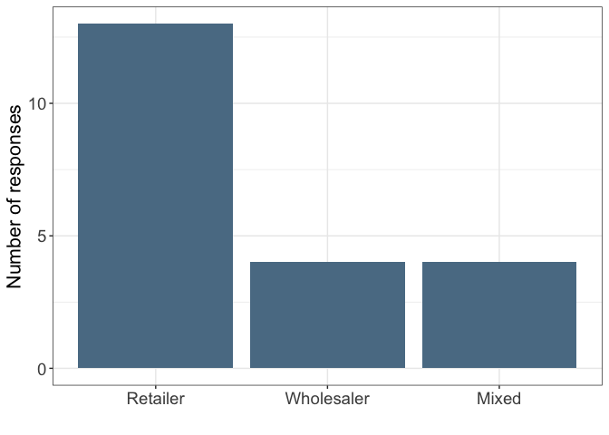
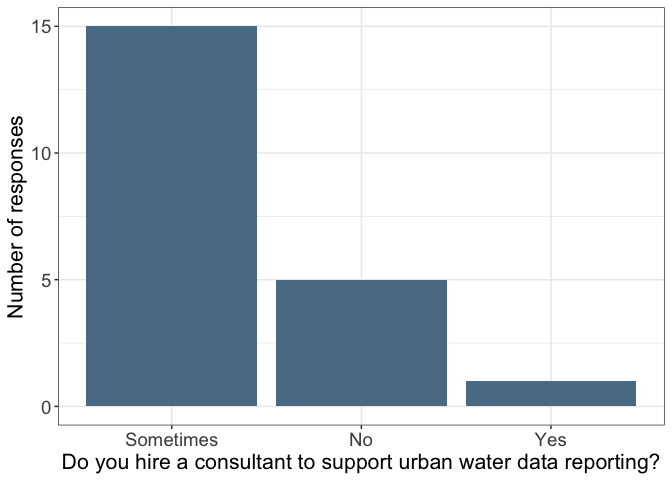
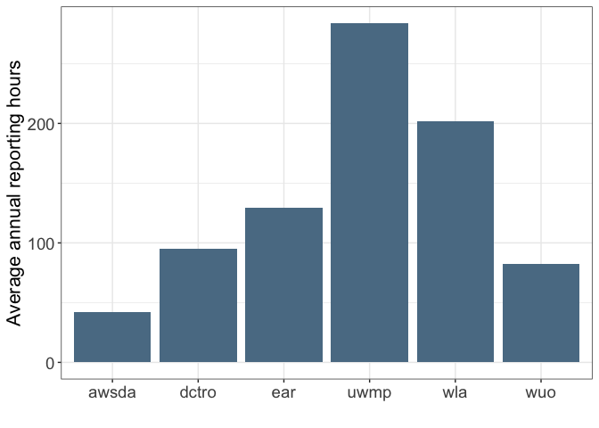
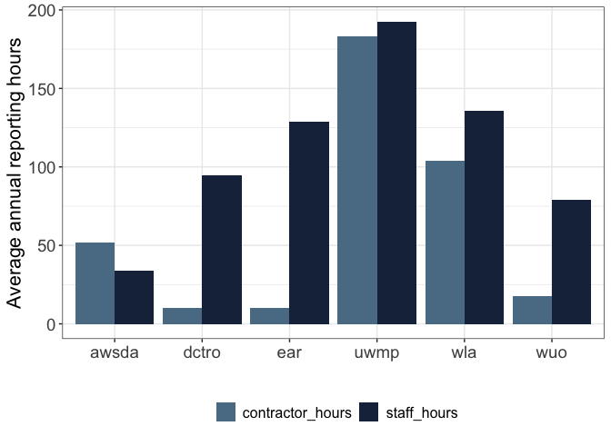
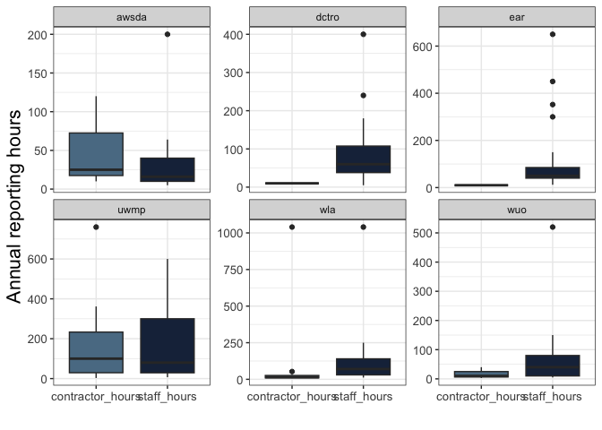
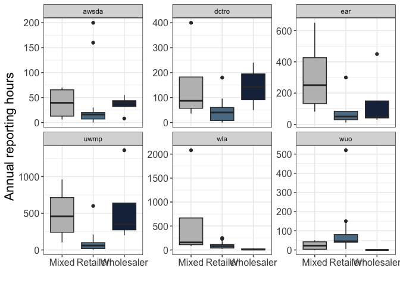

Urban water data - Number of hours for reporting
================
Ashley Vizek (FlowWest)
2025-01-03

# Overview

The California Water Data Consortium surveyed water suppliers to
understand the reporting burden associated with state urban water data
reporting requirements. This document summarizes the responses of this
survey. The survey is available
[here](https://docs.google.com/forms/d/1KLGlqdTlFXfW6dlMXLupx3a_r5fF0ubb-KqbIfMLsqo/edit).

# Summary of responses

As of October 2024, the Consortium received 21 responses including 13
retail suppliers, 4 wholesalers, and 4 both retail and wholesale. 15 of
these agencies sometimes hire a consultant to support urban water data
reporting requirements, 5 never hire a consultant, and 1 always hires a
consultant.

**Number of responses by supplier type**

``` r
clean_data |> 
  group_by(supplier_type) |> 
  tally() |> 
  mutate(supplier_type = factor(supplier_type, levels = c("Retailer", "Wholesaler", "Mixed"))) |> 
  ggplot(aes(x = supplier_type, y = n)) +
  geom_bar(stat = "identity", fill =  "#5a7c93") +
  labs(x = "",
       y = "Number of responses") +
  theme_bw() +
  theme(axis.text = element_text(size = 14),
        axis.title = element_text(size = 16))
```

<!-- -->

``` r
ggsave("figures/number_responses.png", width = 8, height = 8)
```

**Number of suppliers that hire consultants to work on urban water data
reporting requirements**

``` r
clean_data |> 
  group_by(hire_consultant) |> 
  tally() |> 
  mutate(hire_consultant = factor(hire_consultant, levels = c("Sometimes", "No", "Yes"))) |> 
  ggplot(aes(x = hire_consultant, y = n)) +
  geom_bar(stat = "identity", fill =  "#5a7c93") +
  labs(x = "Do you hire a consultant to support urban water data reporting?",
       y = "Number of responses") +
  theme_bw() +
  theme(axis.text = element_text(size = 14),
        axis.title = element_text(size = 16))
```

<!-- -->

``` r
ggsave("figures/hire_contractor.png", width = 8, height = 8)
```

# Reporting time by report type

**Assumptions**

- All hours represent annual investment except for the UWMP which occurs
  every 5 years. If hours were reported by month (e.g. DCRTO), these
  were multiplied by 12. Per request from Tara these numbers were
  updated to all be annual.
- Investment reported in costs was divided by \$150 to determine the
  number of hours.
- If 0 hours were entered, these are removed as this represents
  reporting for those required to submit the report

``` r
long_data |> 
  filter(total_hours > 0) |> 
  group_by(report_type) |> 
  summarize(mean_hours = mean(total_hours),
            sd = sd(total_hours)) |> 
  ggplot(aes(x = report_type, y = mean_hours)) +
  geom_bar(stat = "identity", fill = "#5a7c93") +
  #geom_errorbar(aes(x = report_type, ymin = mean_hours-sd, ymax = mean_hours+sd), position = position_dodge()) +
  labs(x = "",
       y = "Average annual reporting hours",
       fill = "") +
  theme_bw() +
  theme(axis.text = element_text(size = 14),
        axis.title = element_text(size = 16))
```

<!-- -->

``` r
ggsave("figures/average_hours_report_type.png", width = 8, height = 8)
```

``` r
longer_data |> 
  filter(hours > 0) |> 
  group_by(report_type, hour_type) |> 
  summarize(mean_hours = mean(hours),
            sd = sd(hours)) |> 
  ggplot(aes(x = report_type, y = mean_hours, fill = hour_type)) +
  geom_bar(stat = "identity", position = position_dodge()) +
  scale_fill_manual(values = c("#5a7c93","#1b2d48")) +
  #geom_errorbar(aes(x = report_type, ymin = mean_hours-sd, ymax = mean_hours+sd), position = position_dodge()) +
  labs(x = "",
       y = "Average annual reporting hours",
       fill = "") +
  theme_bw() +
  theme(legend.position = "bottom") +
  theme(axis.text = element_text(size = 14),
        axis.title = element_text(size = 16),
        legend.text = element_text(size = 12))
```

    ## `summarise()` has grouped output by 'report_type'. You can override using the
    ## `.groups` argument.

<!-- -->

``` r
ggsave("figures/average_hours_report_type_labor.png", width = 10, height = 8)
```

``` r
  longer_data |>
   filter(hours > 0) |> 
    ggplot(aes(x = hour_type, y = hours, fill = hour_type)) +
    scale_fill_manual(values = c("#5a7c93","#1b2d48")) +
    geom_boxplot() +
    labs(x = "",
         y = "Annual reporting hours",
         fill ="") +
    theme_bw() +
    facet_wrap( ~ report_type, scales = "free_y") +
  theme(legend.position = "none") +
  theme(axis.text = element_text(size = 10),
        axis.title = element_text(size = 16))
```

<!-- -->

``` r
ggsave("figures/boxplot_report_type_labor.png", width = 10, height = 8)
```

``` r
all_reports <- long_data |> 
  group_by(supplier_name) |> 
  summarize(all_reports = sum(total_hours, na.rm = T)) |> 
  ungroup() |> 
  summarize(mean = round(mean(all_reports, na.rm = T),2),
            median = round(median(all_reports, na.rm = T),2),
            min = round(min(all_reports, na.rm = T),2),
            max = round(max(all_reports, na.rm = T),2),
            q25 = round(quantile(all_reports, probs = 0.25, na.rm = T), 2),
            q75 = round(quantile(all_reports, probs = 0.75, na.rm = T), 2),
            `standard deviation` = round(sd(all_reports, na.rm = T),2)) |> 
  mutate(report_type = "all reports")

summary_stats <- long_data |> 
  group_by(report_type) |> 
  filter(total_hours > 0) |> 
  summarize(mean = round(mean(total_hours, na.rm = T),2),
            median = round(median(total_hours, na.rm = T),2),
            min = round(min(total_hours, na.rm = T),2),
            max = round(max(total_hours, na.rm = T),2),
            q25 = round(quantile(total_hours, probs = 0.25, na.rm = T), 2),
            q75 = round(quantile(total_hours, probs = 0.75, na.rm = T), 2),
            `standard deviation` = round(sd(total_hours, na.rm = T),2)) |> 
  bind_rows(all_reports) |> 
  mutate(range = paste0(min, " - ", max)) |> 
  rename(`report type` = report_type) |> 
  select(`report type`, mean, median, q25, q75, `standard deviation`, range)

knitr::kable(summary_stats)
```

| report type |   mean | median |   q25 |   q75 | standard deviation | range       |
|:------------|-------:|-------:|------:|------:|-------------------:|:------------|
| awsda       |  41.95 |   20.0 |  12.5 |  47.5 |              52.88 | 5 - 200     |
| dctro       |  94.89 |   60.0 |  38.0 | 107.5 |              96.80 | 5 - 400     |
| ear         | 129.45 |   55.0 |  40.0 |  85.0 |             167.39 | 12 - 650    |
| uwmp        | 283.65 |  152.5 |  55.0 | 325.0 |             356.87 | 10 - 1360   |
| wla         | 201.74 |   82.0 |  38.0 | 152.5 |             460.33 | 20 - 2080   |
| wuo         |  82.25 |   42.5 |  35.0 |  80.0 |             124.18 | 5 - 520     |
| all reports | 768.60 |  408.0 | 327.6 | 885.0 |             886.12 | 77 - 4161.6 |

``` r
write_csv(summary_stats, "data/summary_stats.csv")
```

**Differences by wholesaler or retailer**

``` r
clean_data |> 
  select(supplier_name, supplier_type) |> 
  distinct() |> 
  group_by(supplier_type) |> 
  tally()
```

    ## # A tibble: 3 × 2
    ##   supplier_type     n
    ##   <chr>         <int>
    ## 1 Mixed             4
    ## 2 Retailer         13
    ## 3 Wholesaler        4

``` r
summary_stats_supplier_type <- long_data |> 
  group_by(report_type, supplier_type) |> 
  summarize(mean = round(mean(total_hours, na.rm = T),2),
            median = round(median(total_hours, na.rm = T),2),
            min = round(min(total_hours, na.rm = T),2),
            max = round(max(total_hours, na.rm = T),2),
            `standard deviation` = round(sd(total_hours, na.rm = T),2)) |> 
  mutate(range = paste0(min, " - ", max)) |> 
  rename(`report type` = report_type,
         `supplier type` = supplier_type) |> 
  select(`report type`, `supplier type`, mean, median, `standard deviation`, range)
```

    ## `summarise()` has grouped output by 'report_type'. You can override using the
    ## `.groups` argument.

``` r
long_data |> 
  ggplot(aes(x = supplier_type, y = total_hours, fill = supplier_type)) +
  geom_boxplot() +
  facet_wrap(~report_type, scales = "free_y") +
  scale_fill_manual(values = c("gray", "#5a7c93","#1b2d48")) +
  theme_bw() +
  theme(legend.position = "none") +
  labs(x = "",
       y = "Annual reporting hours") +
  theme(axis.text = element_text(size = 12),
        axis.title = element_text(size = 16))
```

<!-- -->

``` r
ggsave("figures/boxplot_report_type_supplier.png", width = 10, height = 8)
```

# Data Quality Notes

There is some uncertainty in whether the number of hours for UWMP was
split up by year or reported for the entire UWMP cycle. I will reach out
to respondents for clarity.

## Outreach needed

- <patwater@cvwd.com>: Do the number of hours reported for the UWMP
  represent an annual average or the total number of hours required to
  complete one UWMP cycle?

- <rtooker@roseville.ca.us>: Do the number of hours reported for the
  UWMP represent an annual average or the total number of hours required
  to complete one UWMP cycle?

- <abonczewski@ontarioca.gov>: Do the number of hours reported for the
  UWMP represent an annual average or the total number of hours required
  to complete one UWMP cycle?

- <mmatlock@wmwd.com>: Do the number of hours reported for the UWMP
  represent an annual average or the total number of hours required to
  complete one UWMP cycle?

- <widemank@emwd.org>: Do the number of hours reported for the UWMP
  represent an annual average or the total number of hours required to
  complete one UWMP cycle?

- <StacyT@MesaWater.org>: Do the number of hours reported for the UWMP
  represent an annual average or the total number of hours required to
  complete one UWMP cycle?

- <cgriego@coltonca.gov>: Do the number of hours reported for the UWMP
  represent an annual average or the total number of hours required to
  complete one UWMP cycle?

- <megan.maurino@acwd.com>: Do the number of hours reported for the UWMP
  represent an annual average or the total number of hours required to
  complete one UWMP cycle?

## Resolved

- <jcleaver@sdcwa.org>: Reported as annual average so expanded this
- <jcarney@zone7water.com>: Reported as per cycle
- <lmcphail@mwdh2o.com>: Reported as per cycle
- <lsangines@valleywater.org>: This should be expanded.
- <bbishop@cityofredding.org>: Reported as per cycle
- <alyssaa@soquelcreekwater.org>: per cycle
