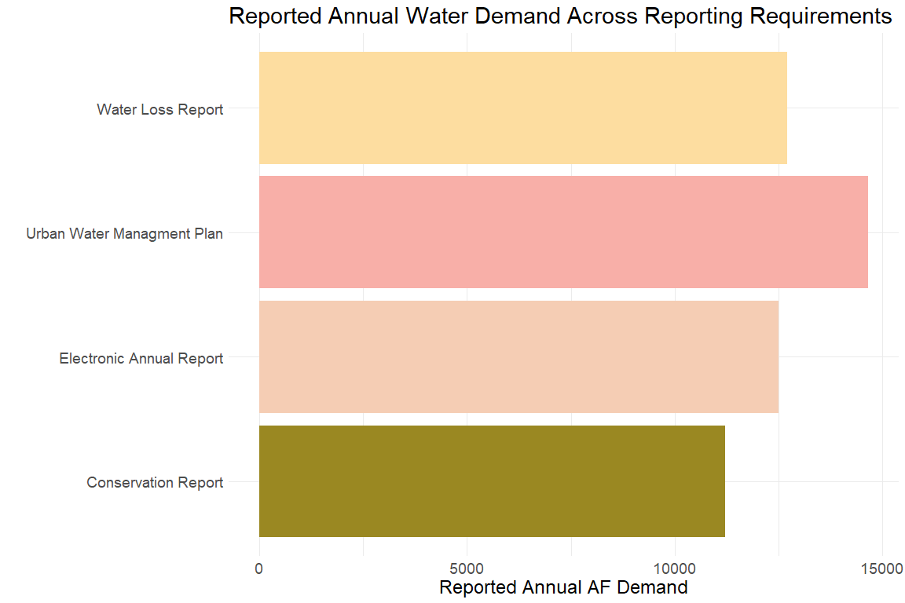

Template Analysis Urban Water Managment
================
Erin Cain
2/1/2022

## City of Napa

## What Reports are we looking at?

``` r
report_1 <- "Urban Water Managment Plan"
report_2 <- "Water Loss Report"
report_3 <- "Conservation Report"
report_4 <- "Electronic Annual Report"
```

## What Metric are we comparing between the reports?

``` r
metric <- "Volume Water Demand in Acre Feet"
```

## What data are we using?

Tables Names:

-   Report 1: [Urban Water Managment
    Plan](https://wuedata.water.ca.gov/uwmp_export_2020.asp)
-   Report 2: [Urban Water Managment
    Plan](https://wuedata.water.ca.gov/awwa_export)
-   Report 3: [Conservation
    Report](https://www.waterboards.ca.gov/water_issues/programs/conservation_portal/conservation_reporting.html)
-   Report 4: [Electronic Annual
    Report](https://www.waterboards.ca.gov/drinking_water/certlic/drinkingwater/eardata.html)

What agency are we focused on?

``` r
agency_of_interest <- "Napa City Of"
```

Load in data:

``` r
data_report_1 <- readr::read_csv("../data-raw/uwmp_retail_total_demand.csv") %>% 
  filter(WATER_SUPPLIER_NAME == "Napa  City Of")
  
data_report_2 <- readxl::read_excel("../data-raw/water_audit_data_conv_to_af.xlsx") %>% 
  filter(REPORTING_YEAR == 2020, WATER_SUPPLIER_NAME == "Napa  City Of") 


data_report_3 <- readxl::read_excel("../data-raw/conservation-report-uw-supplier-data120721.xlsx") %>% 
  mutate(year = lubridate::year(`Reporting Month`)) %>%
  filter(year == 2020, `Supplier Name` == "Napa  City of")


data_report_4 <-  read.delim("../data-raw/EAR_ResultSet_2020RY.txt")

# data_report_4 %>%
#   filter(QuestionName == "PWSName", SectionID %in% c("06 Supply-Delivery", "01 Intro"), QuestionResults == "NAPA, CITY OF") 
data_report_4 <- data_report_4 %>%
  filter(WSSurveyID == 428709) %>%
  filter(SurveyName == "2020 EAR", SectionID %in% c("06 Supply-Delivery", "01 Intro")) 
```

### How is our chosen metric described in the report data?

``` r
volume_demand_report_1 <- "WATER_DEMAND_VOLUME_2020" # check that there is only one catagory, if not sum up
volume_demand_report_2 <- "AC_AUTH_CONSUMPTION_VOL_AF"
volume_demand_report_3 <- c("REPORTED FINAL Total Potable Water Production", "FINAL Percent Residential Use", 
                            "REPORTED FINAL Commercial Agricultural Water", "REPORTED FINAL Commercial, Industrial, and Institutional Water", 
                            "REPORTED Recycled Water", "REPORTED Non-Revenue Water") # Need to sum up reported metrics to get total demand 
volume_demand_report_4 <- "WDAnnualTotal"
```

### Metrics

#### Urban Water Managment Plan

``` r
metric_report_1 <- sum(data_report_1 %>% pull(volume_demand_report_1), na.rm = T)
metric_report_1
```

    ## [1] 14660

#### Water Loss Report

``` r
metric_report_2 <-  data_report_2 %>% pull(volume_demand_report_2)
metric_report_2 
```

    ## [1] 12698.98

#### Conservation Report

``` r
#Check Units
data_report_3 %>% pull(`Water Production Units`) 
```

    ##  [1] "AF" "AF" "AF" "AF" "AF" "AF" "AF" "AF" "AF" "AF" "AF" "AF"

``` r
residential_demand <- sum(data_report_3 %>% pull(volume_demand_report_3[1]) * ((data_report_3 %>% pull(volume_demand_report_3[2]))/100), na.rm = T) 
commercial_agriculture_demand <- sum(data_report_3 %>% pull(volume_demand_report_3[3]), na.rm = T)
comercial_industrial_institutional_demand <- sum(data_report_3 %>% pull(volume_demand_report_3[4]), na.rm = T)
recycled_demand <- sum(data_report_3 %>% pull(volume_demand_report_3[5]), na.rm = T)
non_revenue_demand <- sum(data_report_3 %>% pull(volume_demand_report_3[6]), na.rm = T)
# Units are in AF
metric_report_3 <-  sum(residential_demand, commercial_agriculture_demand, comercial_industrial_institutional_demand, recycled_demand, non_revenue_demand, na.rm = T)
metric_report_3 
```

    ## [1] 11208.2

#### eAR

``` r
# Check Units 
data_report_4 %>% filter(QuestionName == "WDUnitofMeasure") %>% pull(QuestionResults)
```

    ## [1] "MG"

``` r
scale_to_AF <- 3.06888
# Units are in MG, multiply by scaling factor to convert to AF
metric_report_4 <-  as.numeric(data_report_4 %>% 
                                 filter(QuestionName == "WDAnnualTotal") %>% 
                                 pull(QuestionResults)) * scale_to_AF
metric_report_4 
```

    ## [1] 12492.68

### Summarizing Metric Across Reports

``` r
demand_by_report <- tibble("Report" = c(report_1, report_2, report_3, report_4),
                           "Annual AF Demand" = as.numeric(c(metric_report_1, 
                                                             metric_report_2, 
                                                             metric_report_3, 
                                                             metric_report_4)))
```

``` r
library(ggplot2)
ggplot(demand_by_report, aes(y = Report, x = `Annual AF Demand`, fill = Report)) +
  geom_col() + 
  labs(x = "Reported Annual AF Demand", y = "", 
       title = "Reported Annual Water Demand Across Reporting Requirements") +
  theme_minimal() +
  theme(legend.position="none", text = element_text(size=18)) + 
  scale_fill_manual(values = wesanderson::wes_palette("Royal2"))
```

<!-- -->

### Delta of Metrics Across Reports

``` r
total_water_demand_table <- 
  tibble("agency" = rep(c("City of Napa"), 6),
         "reports_compared" = c("UWMP & WLR", "UWMP & CR", "UWMP & EAR", 
                                "WLR & CR", "WLR & EAR", "CR & EAR"),
         "report_a" =  c("UWMP", "UWMP", "UWMP", "WLR", "WLR", "CR"),
         "report_b" =  c("WLR", "CR", "EAR", "CR", "EAR", "EAR"),
         "report_a_metric" = c(metric_report_1, metric_report_1, metric_report_1,
                               metric_report_2, metric_report_2, metric_report_3), 
         "report_b_metric" = c(metric_report_2, metric_report_3, metric_report_4, 
                               metric_report_3, metric_report_4, metric_report_4),)

total_water_demand_af_deltas <- total_water_demand_table %>% 
  mutate(delta = abs(report_a_metric - report_b_metric), 
         percent_delta = abs((report_a_metric / report_b_metric - 1) * 100))

write_rds(total_water_demand_af_deltas, "../data/napa_total_water_demand_af_deltas.rds")
```

### Delta Table

The table below shows the delta between the reports

``` r
clean_na = function(x){
  x %>%
    round(2) %>%
    as.character() %>%
    replace_na('-') %>%
    return()
}

delta_matrix <- total_water_demand_af_deltas %>% 
  select("Reports" = report_a, report_b, delta) %>%
  pivot_wider(names_from = "report_b", values_from = "delta")  %>%
  mutate_if(is.numeric, clean_na)


formattable(delta_matrix, list(area(col = 2:4) ~ color_tile("transparent", "pink")))
```

<table class="table table-condensed">
<thead>
<tr>
<th style="text-align:right;">
Reports
</th>
<th style="text-align:right;">
WLR
</th>
<th style="text-align:right;">
CR
</th>
<th style="text-align:right;">
EAR
</th>
</tr>
</thead>
<tbody>
<tr>
<td style="text-align:right;">
UWMP
</td>
<td style="text-align:right;">
<span
style="display: block; padding: 0 4px; border-radius: 4px; background-color: #ffdce2">1961.02</span>
</td>
<td style="text-align:right;">
<span
style="display: block; padding: 0 4px; border-radius: 4px; background-color: #ffc0cb">3451.8
</span>
</td>
<td style="text-align:right;">
<span
style="display: block; padding: 0 4px; border-radius: 4px; background-color: #ffd8df">2167.32</span>
</td>
</tr>
<tr>
<td style="text-align:right;">
WLR
</td>
<td style="text-align:right;">
<span style="display: block; padding: 0 4px; border-radius: 4px">-
</span>
</td>
<td style="text-align:right;">
<span
style="display: block; padding: 0 4px; border-radius: 4px; background-color: #ffe6ea">1490.78</span>
</td>
<td style="text-align:right;">
<span
style="display: block; padding: 0 4px; border-radius: 4px; background-color: #ffffff">206.29
</span>
</td>
</tr>
<tr>
<td style="text-align:right;">
CR
</td>
<td style="text-align:right;">
<span style="display: block; padding: 0 4px; border-radius: 4px">-
</span>
</td>
<td style="text-align:right;">
<span style="display: block; padding: 0 4px; border-radius: 4px">-
</span>
</td>
<td style="text-align:right;">
<span
style="display: block; padding: 0 4px; border-radius: 4px; background-color: #ffeaed">1284.48</span>
</td>
</tr>
</tbody>
</table>

### % Delta Table

The table below shows the percent delta between the reports

``` r
percent_delta_matrix <- total_water_demand_af_deltas %>% 
  select("Reports" = report_a, report_b, percent_delta) %>%
  pivot_wider(names_from = "report_b", values_from = "percent_delta") %>%
  mutate_if(is.numeric, clean_na)

formattable(percent_delta_matrix, list(area(col = 2:4) ~ color_tile("transparent", "pink")))
```

<table class="table table-condensed">
<thead>
<tr>
<th style="text-align:right;">
Reports
</th>
<th style="text-align:right;">
WLR
</th>
<th style="text-align:right;">
CR
</th>
<th style="text-align:right;">
EAR
</th>
</tr>
</thead>
<tbody>
<tr>
<td style="text-align:right;">
UWMP
</td>
<td style="text-align:right;">
<span
style="display: block; padding: 0 4px; border-radius: 4px; background-color: #ffe1e6">15.44</span>
</td>
<td style="text-align:right;">
<span
style="display: block; padding: 0 4px; border-radius: 4px; background-color: #ffc0cb">30.8</span>
</td>
<td style="text-align:right;">
<span
style="display: block; padding: 0 4px; border-radius: 4px; background-color: #ffdde2">17.35</span>
</td>
</tr>
<tr>
<td style="text-align:right;">
WLR
</td>
<td style="text-align:right;">
<span style="display: block; padding: 0 4px; border-radius: 4px">-
</span>
</td>
<td style="text-align:right;">
<span
style="display: block; padding: 0 4px; border-radius: 4px; background-color: #ffe5ea">13.3</span>
</td>
<td style="text-align:right;">
<span
style="display: block; padding: 0 4px; border-radius: 4px; background-color: #ffffff">1.65
</span>
</td>
</tr>
<tr>
<td style="text-align:right;">
CR
</td>
<td style="text-align:right;">
<span style="display: block; padding: 0 4px; border-radius: 4px">-
</span>
</td>
<td style="text-align:right;">
<span style="display: block; padding: 0 4px; border-radius: 4px">-
</span>
</td>
<td style="text-align:right;">
<span
style="display: block; padding: 0 4px; border-radius: 4px; background-color: #ffecef">10.28</span>
</td>
</tr>
</tbody>
</table>

## Investigating Differences

The largest difference is between the eAR and the Water Loss Report.

TODO Why…?
