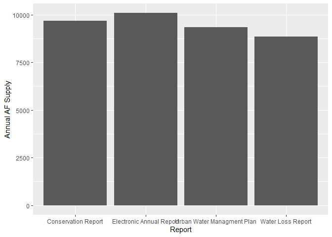

Template Analysis Urban Water Managment
================
Erin Cain
2/1/2022

## Template Analysis for Urban Water Managment

Currently we can use this template to streamline analysis BUT there is
still a lot of manual work. It would be ideal if we could map through
all the reports/metrics/agencies efficiently BUT before we can do that
we need to have all metric pairs and report pairs generated.

TODO discuss which approach makes most sense given quantity of analyzes
we hope to get through.

## What Reports are we looking at?

``` r
report_1 <- "Urban Water Managment Plan"
report_2 <- "Water Loss Report"
report_3 <- "Conservation Report"
report_4 <- "Electronic Annual Report"
```

## What Metric are we comparing between the reports?

``` r
metric <- "Volume Water Supplied in Acre Feet"
```

## What data are we using?

Tables Names:

-   Report 1: (source)
-   Report 2: (source)
-   Report 3: (source)
-   Report 4: (source)

What agency are we focused on?

``` r
agency_of_interest <- "Sante Fe Irrigarion District"
```

Load in data:

``` r
data_report_1 <- readxl::read_excel("../data-raw/uwmp_table_2_2_r_conv_to_af.xlsx") %>% 
  filter(WATER_SUPPLIER_NAME == "Santa Fe Irrigation District")
data_report_1
```

    ## # A tibble: 1 x 10
    ##   ORG_ID WATER_SUPPLIER_NA~ WORKSHEET_NAME      REVIEWED_BY_DWR REQUIREMENTS_AD~
    ##    <dbl> <chr>              <chr>               <chr>           <chr>           
    ## 1   2214 Santa Fe Irrigati~ Table 2-1 Retail O~ No              N/A             
    ## # ... with 5 more variables: WP_WUEDATA_PLAN_ID <dbl>,
    ## #   PUBLIC_WATER_SYSTEM_NUMBER <chr>, PUBLIC_WATER_SYSTEM_NAME <chr>,
    ## #   NUMBER_MUNICIPAL_CONNECTIONS <dbl>, VOLUME_OF_WATER_SUPPLIED_AF <dbl>

``` r
data_report_2 <- readxl::read_excel("../data-raw/water_audit_data_conv_to_af.xlsx") %>% 
  filter(REPORTING_YEAR == 2020, WATER_SUPPLIER_NAME == "Santa Fe Irrigation District")
data_report_2
```

    ## # A tibble: 1 x 128
    ##   DWR_ORGANIZATION_ID WATER_SUPPLIER_NAME SUBMITTED_DATE      WUEDATA_PLAN_REPO~
    ##                 <dbl> <chr>               <dttm>                           <dbl>
    ## 1                2214 Santa Fe Irrigatio~ 2020-12-07 15:55:57               2019
    ## # ... with 124 more variables: CONTACT_NAME <chr>, CONTACT_EMAIL_ADDRESS <chr>,
    ## #   CONTACT_PHONE <chr>, CONTACT_PHONE_EXT <chr>, SUPPLIER_NAME <chr>,
    ## #   CITY_TOWN_MUNICIPALITY <chr>, STATE_PROVINCE <chr>, COUNTRY <chr>,
    ## #   REPORTING_YEAR <dbl>, REPORTING_YEAR_TYPE <chr>,
    ## #   REPORTING_START_DATE <dttm>, REPORTING_END_DATE <dttm>,
    ## #   AUDIT_PREPARATION_DATE <dttm>, VOLUME_REPORTING_UNITS <chr>,
    ## #   PWS_ID_OR_OTHER_ID <chr>, WS_OWN_SOURCES_VOL_COMMENT <chr>, ...

``` r
data_report_3 <- readxl::read_excel("../data-raw/conservation-report-uw-supplier-data120721.xlsx") %>% 
  mutate(year = lubridate::year(`Reporting Month`)) %>%
  filter(year == 2020, `Supplier Name` == "Santa Fe Irrigation District") %>%
  glimpse()
```

    ## Rows: 12
    ## Columns: 29
    ## $ `Supplier Name`                                                        <chr> ~
    ## $ `Public Water System ID`                                               <chr> ~
    ## $ `Reporting Month`                                                      <dttm> ~
    ## $ County                                                                 <chr> ~
    ## $ `Hydrologic Region`                                                    <chr> ~
    ## $ `Climate Zone`                                                         <dbl> ~
    ## $ `Total Population Served`                                              <dbl> ~
    ## $ `Reference 2014 Population`                                            <dbl> ~
    ## $ `County Under Drought Declaration`                                     <chr> ~
    ## $ `Water Shortage Contingency Stage Invoked`                             <chr> ~
    ## $ `Water Shortage Level Indicator`                                       <chr> ~
    ## $ `Water Production Units`                                               <chr> ~
    ## $ `REPORTED PRELIMINARY Total Potable Water Production`                  <dbl> ~
    ## $ `REPORTED FINAL Total Potable Water Production`                        <dbl> ~
    ## $ `PRELIMINARY Percent Residential Use`                                  <dbl> ~
    ## $ `FINAL Percent Residential Use`                                        <dbl> ~
    ## $ `REPORTED PRELIMINARY Commercial Agricultural Water`                   <dbl> ~
    ## $ `REPORTED FINAL Commercial Agricultural Water`                         <dbl> ~
    ## $ `REPORTED PRELIMINARY Commercial, Industrial, and Institutional Water` <dbl> ~
    ## $ `REPORTED FINAL Commercial, Industrial, and Institutional Water`       <dbl> ~
    ## $ `REPORTED Recycled Water`                                              <dbl> ~
    ## $ `REPORTED Non-Revenue Water`                                           <dbl> ~
    ## $ `CALCULATED Total Potable Water Production Gallons (Ag Excluded)`      <dbl> ~
    ## $ `CALCULATED Total Potable Water Production Gallons 2013 (Ag Excluded)` <dbl> ~
    ## $ `CALCULATED Commercial Agricultural Water Gallons`                     <dbl> ~
    ## $ `CALCULATED Commercial Agricultural Water Gallons 2013`                <dbl> ~
    ## $ `CALCULATED R-GPCD`                                                    <dbl> ~
    ## $ Qualification                                                          <chr> ~
    ## $ year                                                                   <dbl> ~

``` r
data_report_3
```

    ## # A tibble: 12 x 29
    ##    `Supplier Name`  `Public Water S~ `Reporting Month`   County `Hydrologic Reg~
    ##    <chr>            <chr>            <dttm>              <chr>  <chr>           
    ##  1 Santa Fe Irriga~ CA3710023        2020-12-15 00:00:00 San D~ South Coast     
    ##  2 Santa Fe Irriga~ CA3710023        2020-11-15 00:00:00 San D~ South Coast     
    ##  3 Santa Fe Irriga~ CA3710023        2020-10-15 00:00:00 San D~ South Coast     
    ##  4 Santa Fe Irriga~ CA3710023        2020-09-15 00:00:00 San D~ South Coast     
    ##  5 Santa Fe Irriga~ CA3710023        2020-08-15 00:00:00 San D~ South Coast     
    ##  6 Santa Fe Irriga~ CA3710023        2020-07-15 00:00:00 San D~ South Coast     
    ##  7 Santa Fe Irriga~ CA3710023        2020-06-15 00:00:00 San D~ South Coast     
    ##  8 Santa Fe Irriga~ CA3710023        2020-05-15 00:00:00 San D~ South Coast     
    ##  9 Santa Fe Irriga~ CA3710023        2020-04-15 00:00:00 San D~ South Coast     
    ## 10 Santa Fe Irriga~ CA3710023        2020-03-15 00:00:00 San D~ South Coast     
    ## 11 Santa Fe Irriga~ CA3710023        2020-02-15 00:00:00 San D~ South Coast     
    ## 12 Santa Fe Irriga~ CA3710023        2020-01-15 00:00:00 San D~ South Coast     
    ## # ... with 24 more variables: Climate Zone <dbl>,
    ## #   Total Population Served <dbl>, Reference 2014 Population <dbl>,
    ## #   County Under Drought Declaration <chr>,
    ## #   Water Shortage Contingency Stage Invoked <chr>,
    ## #   Water Shortage Level Indicator <chr>, Water Production Units <chr>,
    ## #   REPORTED PRELIMINARY Total Potable Water Production <dbl>,
    ## #   REPORTED FINAL Total Potable Water Production <dbl>, ...

``` r
# TODO figure out EAR
data_report_4 <-  read.delim("../data-raw/EAR_ResultSet_2020RY.txt")

data_report_4 <- data_report_4 %>%
  filter(WSSurveyID == 428915) %>%
  filter(SurveyName == "2020 EAR", SectionID %in% c("06 Supply-Delivery", "01 Intro")) %>%
  glimpse()
```

    ## Rows: 273
    ## Columns: 9
    ## $ ï..WSID                   <chr> "CA3710023", "CA3710023", "CA3710023", "CA37~
    ## $ SurveyName                <chr> "2020 EAR", "2020 EAR", "2020 EAR", "2020 EA~
    ## $ WSSurveyID                <chr> "428915", "428915", "428915", "428915", "428~
    ## $ QuestionID                <chr> "28101", "28102", "28103", "28104", "28097",~
    ## $ SectionID                 <chr> "01 Intro", "01 Intro", "01 Intro", "01 Intr~
    ## $ Order                     <chr> "1.05", "1.1", "1.15", "1.2", "1.25", "1.3",~
    ## $ QuestionName              <chr> "PwsID", "PWSName", "WaterSystemClassificati~
    ## $ QuestionResults           <chr> "CA3710023", "SANTA FE I.D.", "Community", "~
    ## $ OldShortName_QuestionText <chr> "Water System No", "Water System Name", "Wat~

### How is our chosen metric described in the report data?

``` r
volume_supplied_report_1 <- "VOLUME_OF_WATER_SUPPLIED_AF"
volume_supplied_report_2 <- "WS_WATER_SUPPLIED_VOL_AF"
volume_supplied_report_3 <- "REPORTED FINAL Total Potable Water Production"
volume_supplied_report_4 <- "WPAnnualTotal"
```

``` r
metric_report_1 <- data_report_1 %>% pull(volume_supplied_report_1)
metric_report_1
```

    ## [1] 9343

``` r
metric_report_2 <-  data_report_2 %>% pull(volume_supplied_report_2)
metric_report_2 
```

    ## [1] 8850.85

``` r
#Check Units
data_report_3 %>% pull(`Water Production Units`) 
```

    ##  [1] "AF" "AF" "AF" "AF" "AF" "AF" "AF" "AF" "AF" "AF" "AF" "AF"

``` r
# Units are in AF
metric_report_3 <-  sum(data_report_3 %>% pull(volume_supplied_report_3))
metric_report_3 
```

    ## [1] 9687.5

``` r
# Check Units 
data_report_4 %>% filter(QuestionName == "WPUnitsofMeasure") %>% pull(QuestionResults)
```

    ## [1] "AF"

``` r
# Units are in AF
metric_report_4 <-  data_report_4 %>% filter(QuestionName == "WPAnnualTotal") %>% pull(QuestionResults)
metric_report_4 
```

    ## [1] "10085.89"

``` r
supply_by_report <- tibble("Report" = c(report_1, report_2, report_3, report_4),
                           "Annual AF Supply" = as.numeric(c(metric_report_1, metric_report_2, metric_report_3, metric_report_4)))


library(ggplot2)
ggplot(supply_by_report, aes(x = Report, y = `Annual AF Supply`)) +
  geom_col()
```

<!-- -->

#### Delta in Supply for UWMP and WLR

``` r
delta_water_supplied <- metric_report_1 - metric_report_2
delta_water_supplied
```

    ## [1] 492.15

``` r
delta_water_supplied_percent <- (metric_report_1 / metric_report_2 - 1) * 100
```

The *difference* in the Volume Water Supplied in Acre Feet between the
Urban Water Managment Plan and Water Loss Report is: 492.15 Acre Feet.

The *percent difference* is: 5.5604829 %.

## TODO add these sections for others (or incoperate into graph)

## If % differnce is significant (define what significant is), why is it different?
